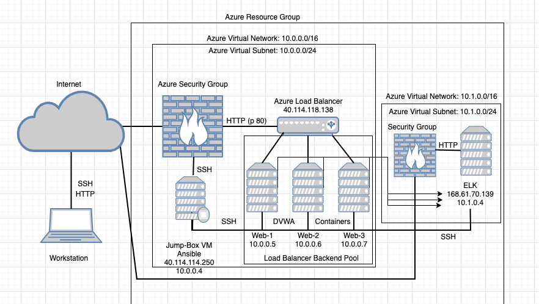
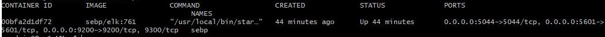

# Project1-UWA-Cybersecurity-Bootcamp

## Automated ELK Stack Deployment

The files in this repository were used to configure the network depicted below.

These files have been tested and used to generate a live ELK deployment on Azure. They can be used to either recreate the entire deployment pictured above. Alternatively, select portions of the ELK file may be used to install only certain pieces of it, such as Filebeat.

  - [ELK Install](Ansible/ELK-Config.yml)
  - [Filebeat Playbook](Ansible/Filebeat-playbook.yml)
  - [Metricbeat Playbook](Ansible/Metricbeat-playbook.yml)

This document contains the following details:
- Description of the Topology
- Access Policies
- ELK Configuration
  - Beats in Use
  - Machines Being Monitored
- How to Use the Ansible Build

### Description of the Topology

The main purpose of this network is to expose a load-balanced and monitored instance of DVWA, the D*mn Vulnerable Web Application.

Load balancing ensures that the application will be highly available, in addition to restricting unauthorized access to the network.
- Load balancers protect an organisation's data and its servers agaisnt distributed denial-of-service (DDoS) attacks. The advantage of using a jump box (jump server) is it only allows access via SSH (Port 22), to an ansible container and other virtual machines running on docker.

Integrating an ELK server allows users to easily monitor the vulnerable VMs for changes to the metrics and system logs.
- Filebeat monitors specified log files or locations, and collects log events.
- Metricbeat collects metric data from servers, data such as CPU, memory and data related to services running on the server. Metricbeat also monitors other beats and ELK stack.

The configuration details of each machine may be found below.
_Note: Use the [Markdown Table Generator](http://www.tablesgenerator.com/markdown_tables) to add/remove values from the table_.

| Name                 | Function   | IP Address | Operating System |
|----------------------|------------|------------|------------------|
| Jump-Box-Provisioner | Gateway    | 10.0.0.4   | Linux            |
| Web-1                | Docker VM  | 10.0.0.5   | Linux            |
| Web-2                | Docker VM  | 10.0.0.6   | Linux            |
| Elk.VM               | Log Server | 10.1.0.4   | Linux            |

### Access Policies

The machines on the internal network are not exposed to the public Internet. 

Only the Jump_Box machine can accept connections from the Internet. Access to this machine is only allowed from the following IP addresses:
- Whitelisted IP address is the local machine's private network

Machines within the network can only be accessed by the Jump Box via SSH (Port 22).
- The Jump_Box machine was allowed to access the ELK machine, through port 5601

A summary of the access policies in place can be found in the table below.

| Name          | Publicly Accessible | Allowed IP Addresses |
|---------------|---------------------|----------------------|
| JumpBox_SSH   | Yes                 | Private Network      |
| Load Balancer | Yes                 | Open                 |
| Web1          | No                  | 10.0.0.5             |
| Web2          | No                  | 10.0.0.6             |
| ELK Server    | Yes                 | 10.1.0.4             |

### Elk Configuration

Ansible was used to automate configuration of the ELK machine. No configuration was performed manually, which is advantageous because...
- Services running can be limited, system installation and update can be streamlined accross other VMs with docker containers, and processes become more replicable.

The playbook implements the following tasks:
- Install docker.io, pip3, and docker module
  ## Use apt module
    - name: Install docker.io
      apt:
        update_cache: yes
        name: docker.io
        state: present

  ## Use apt module
    - name: Install pip3
      apt:
        force_apt_get: yes
        name: python3-pip
        state: present

  ## Use pip module
    - name: Install Docker python module
      pip:
        name: docker
        state: present

- Increase virtual memory to max, then RAM usage
  ## Use command module
    - name: Increase virtual memory
      command: sysctl -w vm.max_map_count=262144
 
  ## Use more RAM
    - name: Use more RAM
      sysctl:
        name: vm.max_map_count
        value: 262144
        state: present
        reload: yes

- Download and launch the docker container for ELK server
  ## Use docker_container module
    - name: download and launch a docker elk container
      docker_container:
        name: elk
        image: sebp/elk:761
        state: started
        restart_policy: always
        published_ports:
          - 5601:5601
          - 9200:9200
          - 5044:5044

The following screenshot displays the result of running `docker ps` after successfully configuring the ELK instance.

### Target Machines & Beats
This ELK server is configured to monitor the following machines:
- Web 1 (10.0.0.5)
- Web 2 (10.0.0.6)

We have installed the following Beats on these machines:
- FileBeat
- MetricBeat

These Beats allow us to collect the following information from each machine:
- Filebeat is a log data shipper for local files. Installed as an agent on your servers, Filebeat monitors the log directories or specific log files, tails the files, and forwards them either to Elasticsearch or Logstash for indexing. An examle of such are the logs produced from the MySQL database supporting our application.
- Metricbeat collects metrics and statistics on the system. An example of such is cpu usage, which can be used to monitor the system health.

### Using the Playbook
In order to use the playbook, you will need to have an Ansible control node already configured. Assuming you have such a control node provisioned: 

SSH into the control node and follow the steps below:
- Copy the Ansible configuraion file to the Web VM's.
- Update the /etc/ansible/hosts file to include IP address of th ELK Server and webservers.
- Run the playbook, and navigate to http://[ELK_Public_IP]:5601/app/kibana to check that the installation worked as expected.

- _Which file is the playbook? It is the Filebeat configuration 
- Where do you copy it? copy /etc/ansible/files/filebeat-config.yml to /etc/filebeat/filebeat.yml
- _Which file do you update to make Ansible run the playbook on a specific machine? Update the filebeat_config.yml
- How do I specify which machine to install the ELK server on versus which to install Filebeat on? By updating the host files with IP addresses of the Web and ELK servers.
- _Which URL do you navigate to in order to check that the ELK server is running? http://[ELK_Public_IP]:5601/app/kibana

_As a **Bonus**, provide the specific commands the user will need to run to download the playbook, update the files, etc._
   ## Installing Filebeat
  - name: Install and Launch Filebeat
    hosts: elk
    become: yes
    tasks:
    
    ## Use command module
  - name: Download filebeat .deb file
    command: curl -L -O https://artifacts.elastic.co/downloads/beats/filebeat/filebeat-7.4.0-amd64.deb

    ## Use command module
  - name: Install filebeat .deb
    command: dpkg -i filebeat-7.4.0-amd64.deb

    ## Use copy module
  - name: Drop in filebeat.yml
    copy:
      src: /etc/ansible/files/filebeat-config.yml
      dest: /etc/filebeat/filebeat.yml

    ## Use command module
  - name: Enable and Configure System Module
    command: filebeat modules enable system

    ## Use command module
  - name: Setup filebeat
    command: filebeat setup

    ## Use command module
  - name: Start filebeat service
    command: service filebeat start

  - name: enable service filebeat on boot
    systemd:
      name: filebeat
      enabled: yes

    ## Install Metric Beat
  - name: Install metric beat
    hosts: webservers
    become: true
    tasks:

    ## Use command module
  - name: Download metricbeat
    command: curl -L -O https://artifacts.elastic.co/downloads/beats/metricbeat/metricbeat-7.4.0-amd64.deb

    ## Use command module
  - name: install metricbeat
    command: dpkg -i metricbeat-7.4.0-amd64.deb

    ## Use copy module
  - name: drop in metricbeat config
    copy:
      src: /etc/ansible/files/metricbeat-config.yml
      dest: /etc/metricbeat/metricbeat.yml

    ## Use command module
  - name: enable and configure docker module for metric beat
    command: metricbeat modules enable docker

    ## Use command module
  - name: setup metric beat
    command: metricbeat setup

    ## Use command module
  - name: start metric beat
    command: service metricbeat start

  - name: Enable service metricbeat on boot
    systemd:
      name: metricbeat
      enabled: yes
